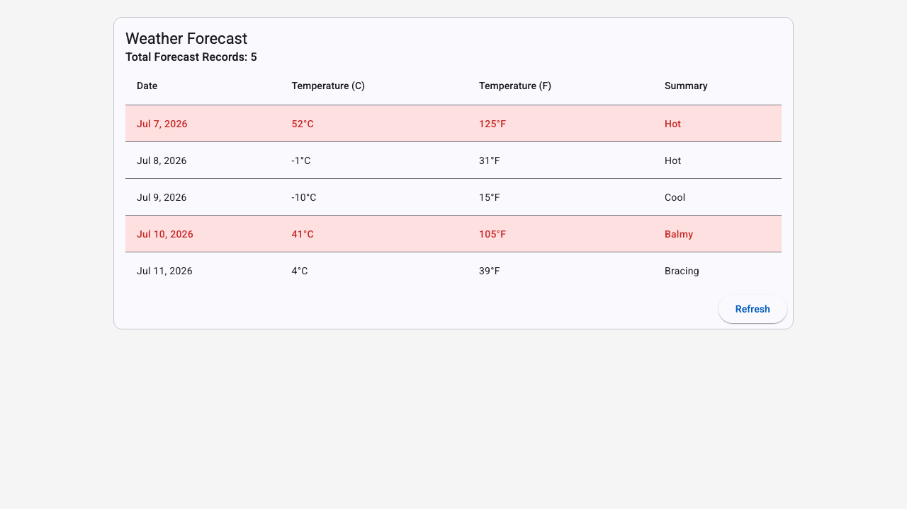
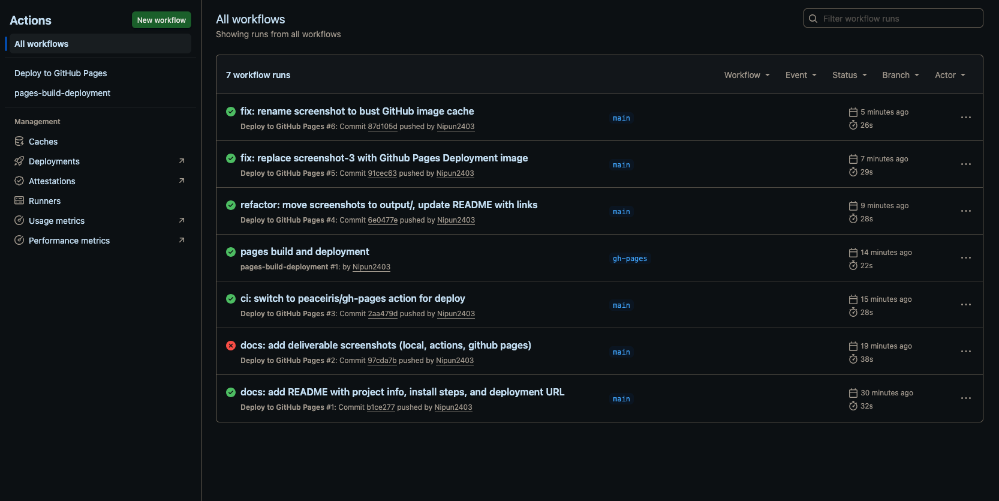
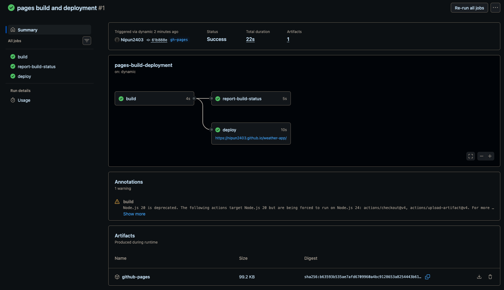

# Weather Dashboard

An Angular weather dashboard that displays weather forecast data from a REST API and automatically deploys to GitHub Pages using GitHub Actions.

## Angular Version

21.2.14

## Features

- Fetches weather forecast data from a public REST API
- Displays forecasts in a Material Design table (Date, Temperature C, Temperature F, Summary)
- Loading spinner during data fetch
- User-friendly error handling
- Responsive design (desktop and mobile)
- Highlighted rows when temperature exceeds 30°C
- Total forecast record count
- Refresh button to reload data

## Installation

```bash
git clone <repository-url>
cd weather-app
npm install
```

## Development Server

Run `ng serve` and navigate to `http://localhost:4200/`. The app auto-reloads on file changes.

## Build

Run `ng build` to build the project. Artifacts are stored in `dist/`.

## Deployment

The application is automatically deployed to GitHub Pages on every push to the `main` branch via GitHub Actions.

### GitHub Pages Deployment

https://nipun2403.github.io/weather-app/

## Screenshots






